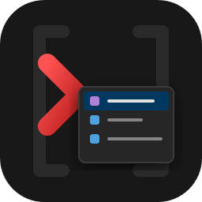

  
  <h1>🚀 Vivado Autocomplete for VS Code</h1>

    

为 FPGA 和 ASIC 硬件工程师打造的 **工业级 Vivado TCL & XDC 智能补全插件**。告别痛苦的官方纯文本编辑器，在 VS Code 中享受丝滑的约束编写体验！

## ✨ 核心特性 (Features)

* 🚀 **全量指令支持**: 内置 Vivado 官方 TCL 命令，涵盖从 Floorplanning 到 Timing 分析的所有操作。
* 🧠 **智能级联补全 (Cascading Autocomplete)**: 
  * 输入首字母，提示顶级命令。
  * 输入 `命令 + 空格` 或 `-`（例如 `create_clock -`），**精准弹出该命令专属的选项参数**（如 `-name`, `-period`, `-add` 等）。
* 📖 **内置官方帮助文档**: 补全时直接在侧边栏渲染 Vivado 官方的完整 Help 描述（包含 Description, Syntax, Usage）
* 🎯 **原生 XDC 完美融合**: 不再将 `.xdc` 粗暴识别为普通纯文本，而是适配 **Xilinx Design Constraints** 语言标识。可与社区主流的 FPGA/TCL 语法高亮插件无缝协同工作，彩色高亮与智能补全我全都要！
* ⚡ **极致性能**: 采用现代化的 `esbuild` 打包和预编译内存字典，即使加载数千个命令的庞大上下文，也保证毫秒级响应，告别卡顿。

## 🎮 使用方法 (Usage)

1. 在 VS Code 中打开任意 `.tcl` 或 `.xdc` 文件。
2. 尝试输入 `add_cells_to_pblock`。
3. 敲击**空格**或输入 `-` 符号，享受神奇的智能参数提示！

## 📦 安装指南 (Installation)

目前你可以通过以下步骤手动安装最新版本：

1. 在本仓库的 [Releases](#) 页面（或向开发者索要）获取最新的 `vivado-completion-x.x.x.vsix` 文件。
2. 打开 VS Code，点击左侧的 **扩展 (Extensions)** 图标。
3. 点击扩展面板右上角的 **`...` (更多操作)**。
4. 选择 **从 VSIX 安装... (Install from VSIX...)**。
5. 选中下载的 `.vsix` 文件，等待右下角提示安装成功即可开箱即用。

## 🛠️ 面向开发者：数据驱动架构 (For Developers)

采用**现代化的数据驱动开发 (Schema-Driven Development)** 架构：

* **自动化流水线**: 
  1. `npm run split-dict`: 强大的 Node.js 脚本会将臃肿的原始 Vivado API 数据清洗并拆分为数千个独立的 `.json` 指令文件，存放在 `data/commands/` 目录下。
  2. `npm run build-dict`: 在代码编译前，脚手架会自动将这些碎片化的 JSON 重新压缩编译为一个极速的 TypeScript 字典常量，供补全引擎加载。

**🤝 如何参与贡献？**

我们非常欢迎提交 Pull Request 来完善指令提示体验！

* **优化单个指令（日常贡献）**: 如果你想为某个特定命令添加更详细的中文解释，或者增加常用的代码补全模板（Snippet），只需在 `data/commands/` 目录下找到对应的 `.json` 文件（例如 `create_clock.json`）并直接修改即可。完成后运行 `npm run package` 测试。
* **升级 Vivado 版本（底层同步）**: 当 Vivado 发布新版本时，只需导出最新的 `data/vivado_api_schema.json` 并重新运行 `npm run split-dict`，即可实现全量指令的无痛升级。

## 📝 许可证 (License)

[MIT License](LICENSE)